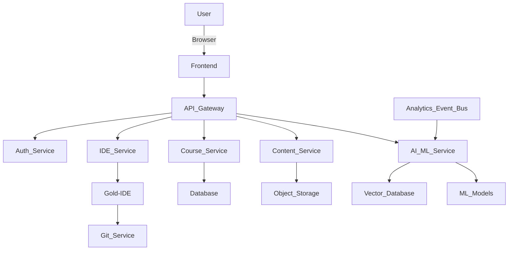
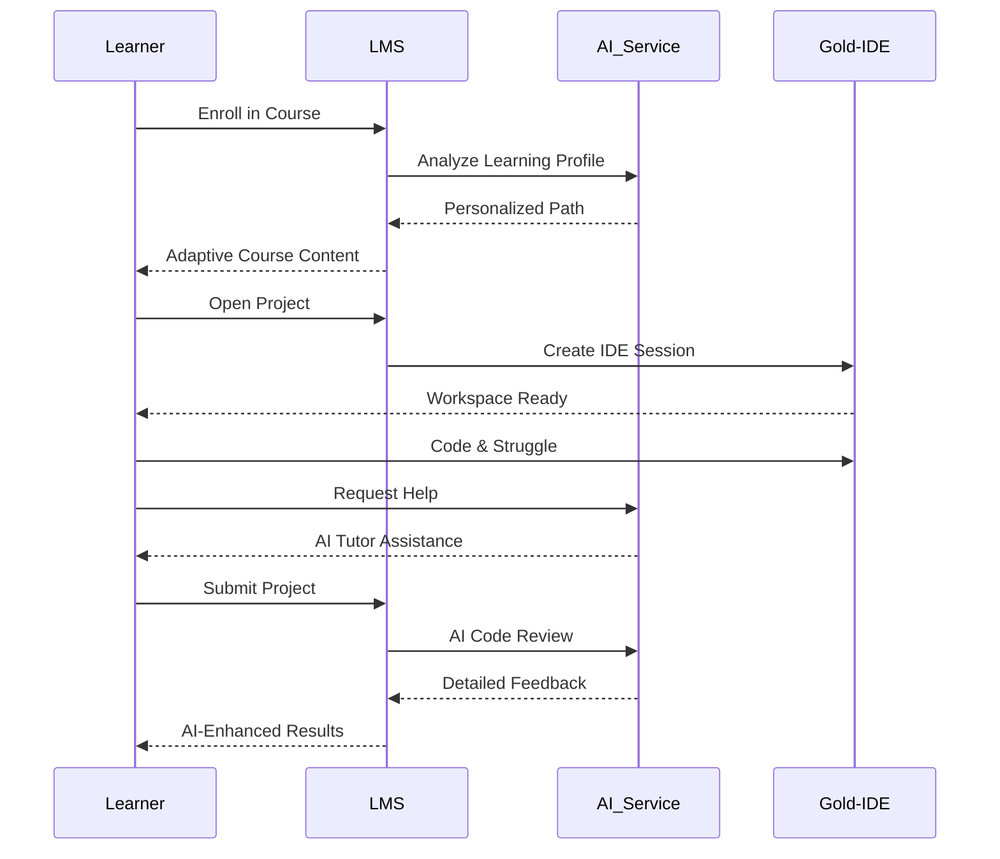
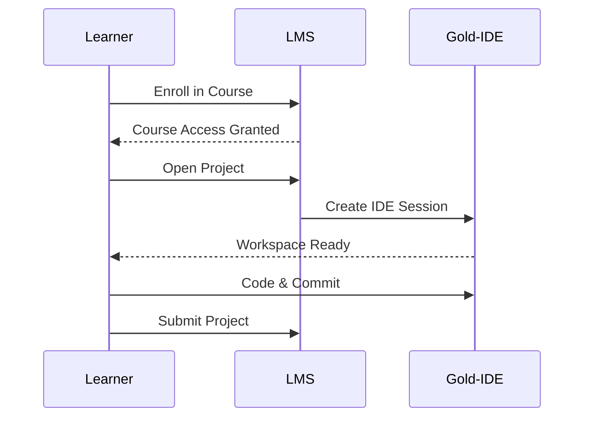
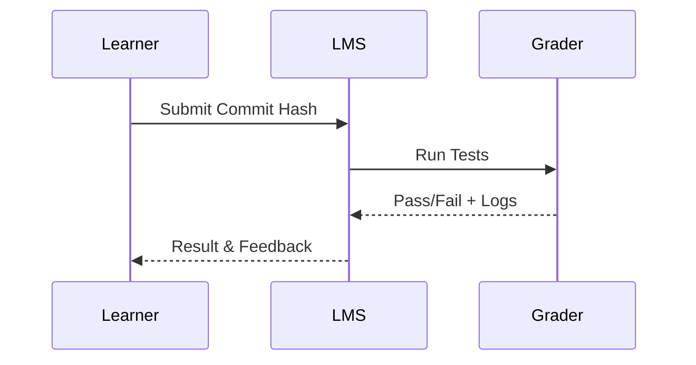
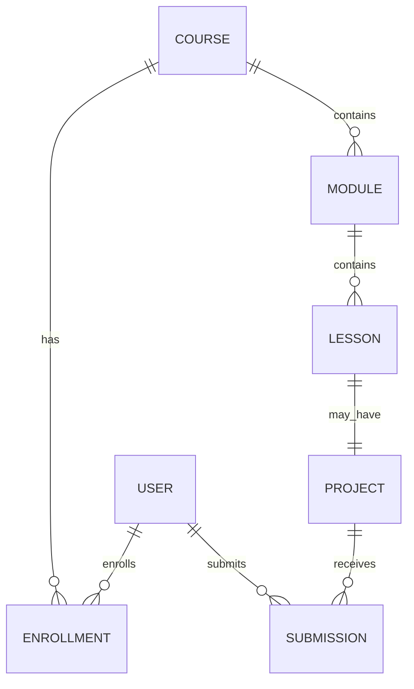

# 🎓 Learning Management System (LMS) Design Document


**🏢 Project:** ChrysosTech — LMS with Gold-IDE integration

**📅 Date:** January 24, 2026

---

## 1. Executive summary

Build a modern, scalable Learning Management System focused on programming education. The LMS will deliver structured learning paths composed of videos, books, and Git-based projects. It will integrate tightly with ChrysosTech's Gold-IDE so learners can open, edit, run, and submit code without leaving the platform. The system targets college students and early-career engineers seeking practical, project-driven learning.

🎯 **Goals:**
- ✨ Provide frictionless learning experience: consume content, code in-browser, submit projects.
- 👥 Support instructors/mentors to create, manage and evaluate courses and projects.
- 🏗️ Scalable architecture supporting video streaming, content CDN, and isolated code execution.
- 📊 Track learner progress and provide analytics, certificates, and placement-ready artefacts.

⏱️ **MVP timeframe:** 3–4 months for core features (see Section 12 — Roadmap & MVP).

---

## 2. Target audience & personas

- 👨‍🎓 **Learner (Primary)**: College students, recent graduates, early-career engineers. Needs: guided learning, hands-on projects, quick feedback, code environment.
- 👨‍🏫 **Instructor/Mentor**: Creates courses, reviews submissions, provides feedback.
- 👨‍💼 **Admin / Ops**: Manages platform, content ingestion, users, billing.
- 🏢 **Corporate/B2B Partner**: Purchases subscriptions, requests custom cohorts and reporting.

---

## 3. Core features (MVP & beyond)

### 🚀 MVP (must-have)
- 🔐 User accounts, authentication (email/password + OAuth with Google/GitHub).
- 📚 Course catalog with categories, search and filters.
- ✏️ Course authoring: modules, lessons, videos, readings (PDF/EPUB), Git-based projects.
- 🎥 Video player with progress tracking and bookmarks.
- Integration with Gold-IDE for live coding and one-click ‘Open in IDE’ on projects/assignments.
- Git project support: clone template repos, make commits, push to user fork or a private repo linked to assignment.
- Submissions: submit via Git URL or via IDE-assisted snapshot.
- Progress tracking (lesson complete, project submitted), basic dashboards for learners and instructors.
- Simple assessments: quizzes (MCQ), manual grading for projects.
- Notifications (email + in-app).

### ✨ Post-MVP / Nice-to-have
- 🤖 Auto-grading for code assignments (unit tests, static analysis) in sandboxed runners.
- 👥 Peer review workflows and mentorship queues.
- 🏆 Certificates (PDF) for course completion.
- 🎯 Recommendations engine using collaborative filtering/content metadata.
- 👨‍🏫 Cohort management for paid batches and enterprise portals.
- 💳 Monetization: payments (Stripe/PayPal), coupon codes, subscriptions.
- 📊 Advanced analytics & BI for engagement, cohort conversion, drop-off.

---

## 3.1 🤖 AI-Powered Features

### 🧠 AI Learning Assistant
- **Intelligent Code Tutor**: Real-time AI assistance within Gold-IDE providing hints, code explanations, and debugging help
- **Personalized Learning Paths**: AI analyzes learner performance and adapts course difficulty and content recommendations
- **Smart Content Generation**: AI-generated practice problems, coding exercises, and quiz questions based on learning objectives
- **Concept Mapping**: AI creates visual knowledge graphs showing relationships between concepts and identifies knowledge gaps

### 📝 AI Assessment & Feedback
- **Automated Code Review**: AI performs sophisticated code analysis beyond unit tests - style checking, best practices, complexity analysis
- **Intelligent Grading**: AI evaluates project submissions using rubrics, provides detailed feedback, and suggests improvements
- **Plagiarism Detection**: AI-powered similarity detection across submissions and external code repositories
- **Skill Assessment**: AI evaluates coding patterns and problem-solving approaches to assess skill levels

### 📚 AI Content Enhancement
- **Video Transcription & Analysis**: Automatic transcription, summarization, and key point extraction from video lectures
- **Interactive Q&A Generation**: AI creates contextual questions from video content and reading materials
- **Content Accessibility**: AI-generated captions, translations, and alternative explanations for different learning styles
- **Knowledge Graph Integration**: AI links related concepts across courses and suggests supplementary materials

### 🎓 AI Student Support
- **24/7 AI Tutor**: Chatbot assistance for course-related questions, debugging help, and concept explanations
- **Progress Prediction**: AI identifies at-risk students based on engagement patterns and suggests interventions
- **Study Schedule Optimization**: AI creates personalized study schedules based on learning patterns and deadlines
- **Career Guidance**: AI analyzes completed courses and skill profiles to suggest career paths and additional learning

### 👨‍🏫 AI Instructor Tools
- **Course Analytics Dashboard**: AI-powered insights into student engagement, common misconceptions, and course effectiveness
- **Automated Question Generation**: AI creates diverse assessment questions from course content
- **Content Gap Analysis**: AI identifies missing topics or weak areas in course curriculum
- **Student Grouping**: AI suggests optimal study groups based on complementary skills and learning styles

### ⚙️ AI Technical Features
- **Intelligent Search**: Natural language search across all course content, code repositories, and discussions
- **Code Completion & Suggestions**: AI-powered code completion within Gold-IDE based on course context
- **Bug Detection**: AI identifies potential bugs and suggests fixes before submission
- **Performance Optimization**: AI analyzes code performance and suggests improvements

### 🏗️ AI Integration Architecture
- **ML Pipeline**: Dedicated microservice for ML model training and inference
- **Vector Database**: Store embeddings for semantic search and recommendations
- **Model Management**: Version control for AI models with A/B testing capabilities
- **Edge AI**: Client-side AI features for real-time code assistance and offline capabilities

### 🛡️ AI Ethics & Privacy
- **Explainable AI**: Transparent AI decisions with clear reasoning for recommendations
- **Data Privacy**: Federated learning approaches to protect student data
- **Bias Detection**: Regular audits of AI models for educational biases
- **Human-in-the-Loop**: Critical decisions require human instructor oversight

---

## 4. 🏗️ High-level architecture

**📋 Overview:** Microservices-oriented backend with a single-page frontend and integrations to external services.

**🧩 Components:**
- 🖥️ **Frontend (SPA)**: React (or Next.js) + Tailwind for UI; communicates with backend APIs. Embeds/launches Gold-IDE via iframe/SDK or deep link.
- 🚪 **API Gateway**: Routes requests to microservices; handles auth tokens, rate limiting.
- 🔐 **Auth Service**: OAuth2 / OpenID Connect, sessions, MFA support.
- 📺 **Content Service**: Manages videos, PDFs, metadata, transcoding pipeline.
- 📚 **Course Service**: Stores course/module/lesson metadata and versioning.
- 🔄 **Git Integration Service**: Orchestrates creating forks/templates, webhooks, commit tracking.
- 💻 **IDE Integration Service**: Securely issues tokens and session links to Gold-IDE. Handles context passing (repo URL, branch, assignment metadata).
- ⚡ **Execution / Auto-grader Service**: Runs unit tests in ephemeral sandboxes (Kubernetes pods/Firecracker) and returns results.
- 🤖 **AI/ML Service**: Machine learning models for recommendations, content generation, code analysis, and student analytics.
- 🔍 **Vector Database**: Stores embeddings for semantic search and AI-powered content recommendations.
- 🔔 **Notification Service**: Email, push, in-app.
- 📊 **Analytics / Event Bus**: Event stream (Kafka) for learner actions, fed into analytics/BI and AI models.
- 📦 **Storage**: Object store (S3-compatible) for media, attachments, and user artifacts.
- 🚀 **CDN**: Serve static assets and video segments.
- 🗄️ **DBs**: Relational DB (Postgres) for relational data, Redis for caching/sessions, and search (Elasticsearch / OpenSearch).

**🚀 Deployment:** Kubernetes cluster (GKE/EKS/AKS) with autoscaling, CI/CD pipelines for deployments.

---

## 5. 📋 Detailed feature designs

### 5.1 📚 Course structure
- **Course** → metadata (title, description, tags, instructors, price, visibility)
- **Module** → ordered container inside Course
- **Lesson** → may be a video, reading, quiz, or project
- **Project** → Git template repo + assignment spec + evaluation criteria

Versioning: courses and lessons should support drafts and published versions.

### 5.2 🎬 Media (Video & Books)
- Upload video → Transcoding (multiple resolutions) → HLS/DASH segments → CDN.
- Store captions (VTT), require captions for accessibility.
- Books (PDF/EPUB) stored in object store; offer in-browser reader and download option if allowed.
- Video player: resume, speed control, timestamped notes, transcripts search.

### 5.3 🔄 Git projects and IDE flow
**Authoring:** Instructor links a template repo, sets branch, test scripts, and starter issues.

**Learner flow:**
1. Learner clicks “Open in Gold-IDE” on project page.
2. LMS calls IDE Integration Service to create an IDE session token and a workspace (fork or ephemeral workspace containing repo).
3. Gold-IDE opens with workspace and preinstalled dependencies.
4. Learner codes, runs tests locally in IDE, commits and pushes.
5. Learner clicks “Submit” — LMS records submission (Git commit hash or snapshot) and triggers auto-grader (if enabled).

**Submission models:**
- Fork + PR to instructor repo.
- Commit to a private branch in a central repo with commit reference.
- ZIP snapshot uploaded to LMS (fallback).

**Security:** restrict runner privileges; network egress rules; ensure user code cannot access internal services.

### 5.4 ⚡ Auto-grading & Sandboxing
- Use container-based ephemeral runners (Kubernetes pods, possibly Firecracker for better isolation) per submission.
- Runner pulls the submission, installs dependencies, runs tests (pre-configured by instructor), and reports results.
- Return logs and test output to user and instructor.

### 5.5 📝 Assessment & Feedback
- Manual review queue for mentors with grading rubric.
- Inline code commenting via GitHub/GitLab-style reviewer UI or via LMS UI (diff + comments).
- Peer reviews and rating for projects.

---

## 6. 🗄️ Data model (key entities)

- **User** (id, name, email, role(s), profile, linked accounts)
- **Organization** (for B2B)
- **Course** (id, slug, title, description, instructors, price, tags, state)
- **Module** (id, course_id, title, order)
- **Lesson** (id, module_id, type, metadata)
- **Media** (id, type, storage_url, captions)
- **Project** (id, lesson_id, repo_template_url, test_config)
- **Enrollment** (user_id, course_id, role, progress)
- **Progress** (user_id, lesson_id, status, timestamps)
- **Submission** (id, user_id, project_id, git_commit, score, feedback)
- **Assessment** (id, submission_id, grader_id, rubric, comments)
- **Event** (user_id, action, metadata, ts)

---

## 7. 🔌 API & Integration contract

- RESTful JSON APIs for frontend interactions; consider GraphQL for flexible client queries.
- **Auth endpoints**: /auth/login, /auth/refresh, /auth/oauth/callback
- **Course endpoints**: /courses, /courses/{id}, /courses/{id}/modules
- **Media endpoints**: /media/upload, /media/{id}/playback-token
- **IDE endpoints**: /ide/session-create — accepts user_id, project_id, repo_url, callback URL. Returns secure short-lived session token and launch URL.
- **Git endpoints**: /git/create-fork, /git/webhook-handler
- **Submission endpoints**: /submissions, /submissions/{id}/grade

Security: all endpoints protected with JWTs; scope-based authorization for role-specific actions.

---

## 8. 🎨 UI / UX

Principles:
- Minimal, distraction-free learning interface.
- Single-pane course view: navigation on the left, content on the right.
- Strong affordance to “Open in Gold-IDE” on every project/assignment.
- Mobile responsive, but coding workflows optimized for desktop.

Pages & flows:
- Landing & course catalog with search/filters.
- Course detail page with syllabus, instructor bios, enroll CTA.
- Learning player page for lessons (video + transcript + notes + next button).
- Project page with spec, repo link, “Open in IDE”, and submit button.
- Instructor dashboard with pending submissions and analytics.

Accessibility: keyboard navigation, semantic HTML, captions/transcripts for videos.

---

## 9. 🔒 Security & Compliance

- Data encryption at rest and in transit (HTTPS + TLS). Encrypt PII stored in DB where necessary.
- RBAC for actions (Admin, Instructor, Mentor, Learner).
- Secure code execution environment: least privilege containers, network egress control, quota limits, timeouts, and resource limits.
- Sanitize and validate all uploads. Scan artifacts for secrets (prevent accidental leak of keys).
- GDPR/Privacy: Data export, right to forget, consent for tracking.

---

## 10. 📈 Scalability & Performance

- Use CDNs for static and streaming assets.
- Transcode videos once and store HLS segments; serve via CDN.
- Horizontal scale stateless services; stateful services (DB) scale vertically with read replicas.
- Use asynchronous workers for heavy tasks (transcoding, auto-grading, analytics aggregation).
- Caching layer (Redis) for sessions, frequent queries, and rate-limiting counters.

---

## 11. 🔍 Observability & Monitoring

- Centralized logging (ELK / EFK) and structured logs.
- Metrics (Prometheus + Grafana) for system health, queue lengths, grading throughput.
- Tracing (OpenTelemetry) for end-to-end request tracing (especially IDE handoffs and grading runs).
- Alerting for failed jobs (transcoding, grading), high error rates, and resource exhaustion.

---

## 12. 🗺️ Roadmap & MVP

**Phase 0 — Planning (2 weeks)**
- Finalize feature list, data model, UX wireframes, and tech stack.
- Prepare CI/CD and dev environments.

**Phase 1 — Core MVP (8–10 weeks)**
- User auth, basic course catalog, course authoring for video/book content.
- Video ingestion + playback + caption support.
- Project scaffolding with repository templates and basic Git flow.
- Gold-IDE integration: launch flow and workspace provisioning.
- Basic progress tracking, enrollment, and submission capture.

**Phase 2 — Essential add-ons (6–8 weeks)**
- Auto-grading and sandboxed runners.
- Instructor grading UI, feedback, and certificates.
- Payments and subscription management.
- Analytics and basic recommendation engine.

**Phase 3 — Scale & polish (ongoing)**
- Peer review flows, mentorship queues, enterprise features, deep analytics, and A/B testing.

---

## 13. 🛠️ Suggested tech stack

- 🖥️ **Frontend:** React or Next.js, Tailwind CSS
- ⚙️ **Backend:** Node.js (NestJS / Express) or Python (FastAPI) or Java (Spring Boot)
- 🗄️ **DB:** PostgreSQL
- 🔍 **Search:** OpenSearch / Elasticsearch
- 🧠 **Vector Database:** Pinecone, Weaviate, or pgvector for AI embeddings
- 📨 **Queue/Event Bus:** Kafka / RabbitMQ
- 📦 **Object Storage:** S3-compatible (AWS S3 / MinIO)
- 🐳 **Container orchestration:** Kubernetes
- 🔄 **CI/CD:** GitHub Actions / GitLab CI
- 🔐 **Auth:** Keycloak / Auth0 / custom OAuth2
- 🎬 **Video processing:** FFmpeg + MediaConvert (or self-hosted transcoder)
- 📊 **Monitoring:** Prometheus + Grafana; ELK for logs
- 🤖 **AI/ML Framework:** TensorFlow/PyTorch for custom models, Hugging Face for NLP
- 🔬 **ML Operations:** MLflow for model tracking, Kubeflow for ML pipelines
- 🧠 **AI APIs:** OpenAI GPT-4, Anthropic Claude, or self-hosted LLMs
- 🔍 **Code Analysis:** AST parsers, CodeQL, or custom ML models
- 💬 **Natural Language Processing:** spaCy, NLTK, or transformer models

---

## 14. Gold-IDE integration specifics

Integration goals:
- One-click `Open in Gold-IDE` that opens a pre-configured workspace with the learner's code.
- Secure token-based handoff and return callback to LMS when learner submits a project.

Integration options:
1. **Deep-link + token**: LMS requests an expiring session token from the IDE Integration Service. The frontend opens Gold-IDE in a new tab or iframe using a URL containing the token and metadata (repo URL, branch, file to open).
2. **SDK / iframe**: If Gold-IDE exposes an embeddable SDK/iframe, embed the IDE inside the course page. Provide LMS commands to the iframe via postMessage for actions like `saveSnapshot`, `runTests`, `createPR`.
3. **LTI (if Gold-IDE supports it)**: Standardized LMS-IDE integration for single sign-on and context passing.

Security & UX considerations:
- Short-lived signed tokens for session creation.
- Consent screen when giving the IDE repo access.
- Ensure logout flows and session revocation.
- UX: present a consistent header with a return button to the LMS and an auto-save indicator.

---

## 15. Testing strategy

- Unit tests for services and UI components.
- Integration tests for API flows, especially IDE handoff and submission flows.
- E2E tests that simulate learner flows (enroll → open IDE → submit).
- Load testing for video service and auto-grader queue.
- Security tests: vulnerability scans, container escape tests for sandboxes.

---

## 16. Privacy, legal & licensing

- Terms of service and privacy policy covering content licenses, user-generated content, and data retention.
- Licensing model for books and video content (owned vs licensed).
- If using third-party repos in assignments, ensure licenses comply with distribution.

---

## 17. Cost considerations (high level)

Largest costs: video storage & CDN, compute for grading/sandboxes, and IDE sessions (if Gold-IDE charges per session). Use autoscaling and spot/preemptible instances for cost efficiency.

---

## 18. Open questions / decisions to make

- Will submissions be accepted via forks/PRs (GitHub) only, or support private repos and snapshots?
- Which auto-grading model do we prioritize (unit-tests, static analyzers, containerized evaluation)?
- Host video ourselves or use a managed streaming service (to trade off complexity vs cost)?
- Extent of Gold-IDE embedding (new tab vs iframe vs deep embed)?

---

## 19. Next steps (recommended immediate actions)
1. Choose the tech stack and confirm Gold-IDE integration capabilities (SDK, deep-link, or LTI).
2. Build core data model and wireframes for course & project flows.
3. Prototype one end-to-end lesson: upload a video, create a simple Git project, open in Gold-IDE, submit and record progress.
4. Decide hosting and video strategy (self-transcode vs managed).

---

## Appendix

### Useful UX micro-flows
- **Instructor adding a project:** Create lesson → link template repo → write spec + test script → set due date and rubric → publish.
- **Learner submitting project via IDE:** Open in IDE → work → run tests → push → click "Submit" in LMS (LMS validates commit + triggers grader).

### Minimal acceptance criteria for MVP
- A learner can enroll in a course, view a lesson (video or reading), open a Git project in Gold-IDE, and submit a commit that the LMS records.
- Instructor can view submissions and mark them reviewed.

---

## 20. UI Wireframes (Low‑Fidelity)

> These are **conceptual wireframes** to guide UI/UX and frontend development. Final visuals will be refined during design sprints.

---

### 20.1 Landing Page

Purpose: Discovery, trust building, and conversion.

```
+--------------------------------------------------+
| Logo | Courses | Pricing | Login | Sign Up     |
+--------------------------------------------------+
| 🎓 Learn to Code with Real Projects              |
| [Browse Courses]  [Try Free Lesson]              |
+--------------------------------------------------+
| 🔥 Popular Courses (Cards Grid)                  |
| [Java] [Python] [Web Dev] [AI/ML]                |
+--------------------------------------------------+
| Why ChrysosTech LMS                              |
| • Learn by building                              |
| • Gold-IDE integrated                          |
| • Mentor feedback                                |
+--------------------------------------------------+
| Footer                                           |
+--------------------------------------------------+
```

---

### 20.2 Authentication Pages (Login / Signup)

```
+-------------------------------+
| Login to ChrysosTech LMS      |
+-------------------------------+
| Email                         |
| Password                      |
| [ Login ]                     |
| ----------------------------  |
| Login with Google | GitHub    |
+-------------------------------+
```

---

### 20.3 Course Catalog Page

```
+--------------------------------------------------+
| Filters | Search 🔍                               |
+--------------------------------------------------+
| [Course Card] [Course Card] [Course Card]        |
| [Course Card] [Course Card] [Course Card]        |
+--------------------------------------------------+
```

Each **Course Card**:
- Title
- Level (Beginner / Intermediate / Advanced)
- Duration
- Enroll / View button

---

### 20.4 Course Detail Page

```
+--------------------------------------------------+
| Course Title                                     |
| Instructor | Rating | Enroll Button              |
+--------------------------------------------------+
| About Course | Syllabus | Reviews                 |
+--------------------------------------------------+
| Module 1: Basics                                 |
|   - Lesson 1 (Video)                             |
|   - Lesson 2 (Reading)                           |
| Module 2: Project                                |
|   - Build XYZ App                                |
+--------------------------------------------------+
```

---

### 20.5 Learning Player Page (Lesson View)

```
+--------------------------------------------------+
| Sidebar (Modules & Lessons) | Lesson Content     |
|                              | ---------------- |
|                              | Video Player      |
|                              | Transcript        |
|                              | Notes             |
+--------------------------------------------------+
| [ Previous ]                       [ Next ]      |
+--------------------------------------------------+
```

---

### 20.6 Project / Assignment Page

```
+--------------------------------------------------+
| Project: Build REST API                          |
+--------------------------------------------------+
| Problem Statement                                |
| Requirements                                     |
| Evaluation Criteria                              |
+--------------------------------------------------+
| [ Open in Gold-IDE ]   [ View Repo ]            |
+--------------------------------------------------+
| Submission Status: Not Submitted                 |
| [ Submit Project ]                               |
+--------------------------------------------------+
```

---

### 20.7 Gold-IDE Embedded / Launch View

```
+--------------------------------------------------+
| ← Back to LMS | Project Name | Auto‑Save ✓       |
+--------------------------------------------------+
| File Explorer | Code Editor | Terminal           |
|               |             |                   |
+--------------------------------------------------+
| [ Run Tests ] [ Commit ] [ Submit to LMS ]       |
+--------------------------------------------------+
```

---

### 20.8 Learner Dashboard

```
+--------------------------------------------------+
| My Dashboard                                     |
+--------------------------------------------------+
| Progress Overview                                |
| [██████░░░░] Java Backend Course                 |
+--------------------------------------------------+
| My Courses | Certificates | Submissions          |
+--------------------------------------------------+
```

---

### 20.9 Instructor Dashboard

```
+--------------------------------------------------+
| Instructor Panel                                 |
+--------------------------------------------------+
| Courses Created | Pending Reviews | Analytics    |
+--------------------------------------------------+
| [Project Submission List]                        |
| Student | Project | Status | Review Button       |
+--------------------------------------------------+
```

---

## 21. Mermaid Diagrams

### 21.1 System Architecture Diagram



---

### 21.2 AI-Enhanced Learning Flow



---

### 21.3 Course & Learning Flow (Original)



---

### 21.4 Project Submission & Auto‑Grading Flow



---

### 21.5 Database ER (Simplified)



---

## 22. UI Development Notes

- Use **component‑driven design** (Storybook recommended).
- Reusable components: CourseCard, LessonSidebar, IDEButton, ProgressBar.
- Consistent CTA color for `Open in Gold-IDE` across platform.
- Dark mode recommended (especially for IDE‑heavy workflows).

---

*End of document.*

