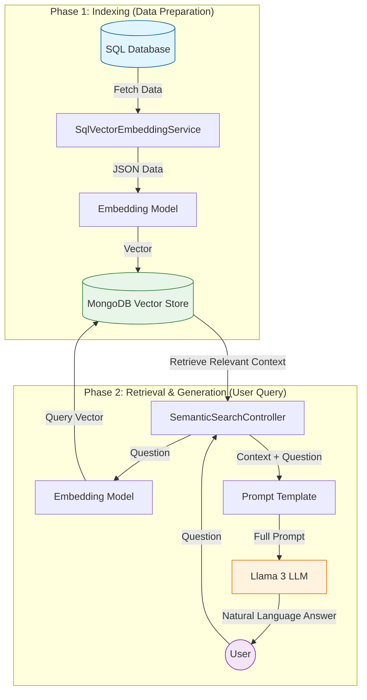
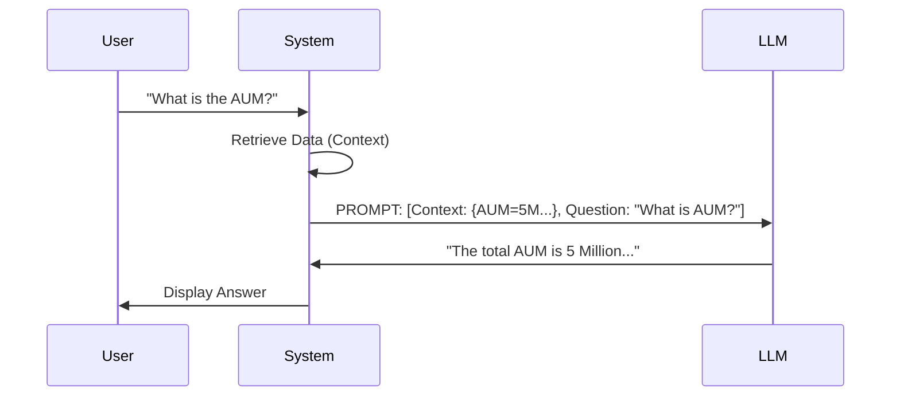

# Intelligent Reporting Engine: RAG, Semantic Search & LLM Architecture

## 1. High-Level Goal
**Objective:** Transform natural language questions into data-rich reports by intelligently querying a database, analyzing results, and presenting them in a user-friendly format.

This system bridges the gap between raw data and human understanding using **Retrieval-Augmented Generation (RAG)**.

---

## 2. Core Components
Our AI engine is built on four pillars:

| Component | Technology Used | Role |
| :--- | :--- | :--- |
| **LLM** | **Llama 3** (8B) | The "Brain": Reasons, summarizes, and generates natural language responses. |
| **Embedding Model** | **Nomic Embed Text** | The "Translator": Converts text and data into vector representations (numbers). |
| **Vector Database** | **MongoDB** | The "Memory": Stores vectors and enables semantic similarity search. |
| **Prompt Engine** | Custom Templates | The "Instructor": Guides the LLM to provide accurate and formatted answers. |

---

## 3. The RAG Workflow
The system operates in two main phases: **Indexing** (preparing the data) and **Retrieval & Generation** (answering the user).

### Architecture Diagram



### Detailed Steps

#### A. Indexing (The "Filing Cabinet")
1.  **Data Fetching:** `SqlVectorEmbeddingService` executes predefined SQL queries (e.g., `Total_AUM.sql`) to get current business metrics.
2.  **Vectorization:** The results are converted to JSON. The **Embedding Model** (Nomic Embed) processes this JSON to create a "vector embedding"—a numerical representation of the data's meaning.
3.  **Storage:** The vector and the original data are saved into **MongoDB**. This creates a searchable knowledge base.

#### B. Retrieval (The "Librarian")
1.  **User Query:** A user asks, *"How has the portfolio grown this quarter?"*
2.  **Search:** `SemanticSearchService` converts this question into a vector using the same Embedding Model.
3.  **Similarity Match:** The system queries MongoDB for data vectors that are mathematically closest to the question vector. This retrieves the most relevant data (e.g., the QTD Growth report) without needing exact keyword matches.

#### C. Generation (The "Report Writer")
1.  **Context Assembly:** The retrieved data is combined with the user's question.
2.  **Prompting:** This combination is wrapped in a prompt template (from `semantic-search-prompt.txt`).
3.  **Response:** The **Llama 3 LLM** reads the prompt and generates a coherent, fact-based answer.

---

## 4. Configuration & Models
The system is configured via `application.properties`.

```properties
# The Brain: Llama 3 for generating text
spring.ai.ollama.chat.options.model=llama3:8b

# The Translator: Nomic Embed for generating embeddings
spring.ai.ollama.embedding.model=nomic-embed-text

# The Memory: MongoDB for storing vectors
spring.data.mongodb.uri=mongodb+srv://...
```

---

## 5. The Role of Prompt Engineering
**File:** `src/main/resources/semantic-search-prompt.txt`

The prompt is the interface between our code and the LLM's intelligence. It ensures reliability by:
*   **Setting Context:** "You are an AI assistant..."
*   **Bounding Knowledge:** "Answer based ONLY on the provided context."
*   **Formatting:** "Provide a summary followed by key metrics."



---

## 6. Summary
By leveraging **RAG**, this project moves beyond static dashboards. It allows users to interact with their data conversationally, ensuring that answers are not just generated, but are **grounded in actual database records** retrieved via semantic search.
